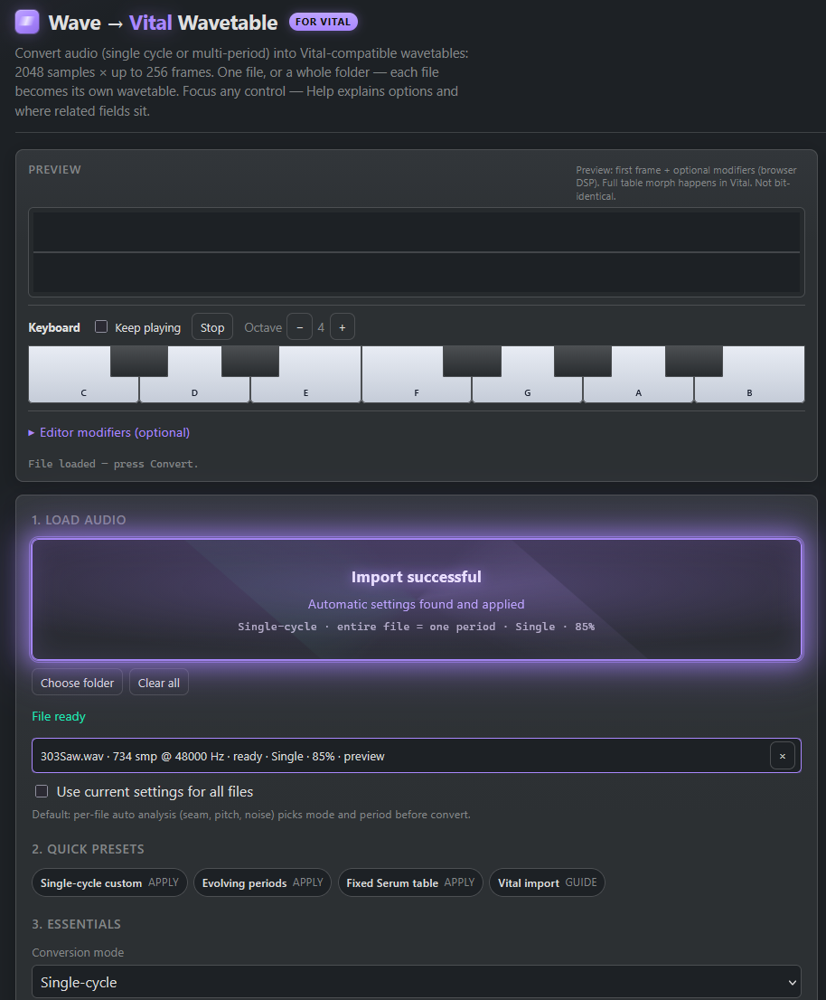

**[Open the app →](https://megagoth1702.github.io/Vital-Synth-Simple-Wavetable-Creator/)**

# Simple Wavetable Creator (Vital + Behringer WAVE)

---

## Who this is for

**Vital** (and Serum-style) sound designers who work with **single-cycle waves** or short audio material and want clean **wavetable** imports — not pitch-spliced samples. Also **Behringer WAVE** owners who load user tables through **SynthTribe**.

## The problem

Vital’s “import as Wavetable” expects **2048 samples per frame**.  
Custom cycles (512, 600, 1024, …) or multi-period recordings **break or mis-frame** when you drop the raw file in. You need a correctly sized table first.

Behringer WAVE needs **128 samples × 64 waves** (via SynthTribe). Feeding a long Vital table and guessing “Number of Samples” is error-prone.

## The fix

This is a **free, browser-only** tool: drop audio in, download either:

- **Vital / Serum** — mono float WAV (**2048 × up to 256 frames**), or  
- **Behringer WAVE** — mono 16-bit PCM (**128 × 64**), ready for SynthTribe  

Nothing is uploaded.

## Features

- **Vital export:** **2048 samples per frame** · **up to 256 frames** · mono 32-bit float · optional Vital/Serum `clm`
- **Behringer WAVE export:** **128 × 64** mono 16-bit PCM for SynthTribe (More options checkbox)
- **Smooth frames** default (spectral morph bake) · **Fourier resample** for periodic cycles
- **Any browser-decodable audio** (WAV, MP3, OGG, FLAC, …)
- **Single file** or **batch folder** — each input becomes **its own** wavetable; batch downloads a **ZIP**
- **Live audition**: waveform of frame 0 + monophonic keyboard; optional editor modifiers
- **In-app help** EN / DE (flag toggle)

## Use

1. **[Open the app](https://megagoth1702.github.io/Vital-Synth-Simple-Wavetable-Creator/)** (or host the static files yourself).
2. Drop a single audio file or a folder of files.
3. Pick mode / options; use help panel (EN/DE) for guidance.
4. Download a `.wav` (or a ZIP of one wavetable per source file).
5. **Vital:** oscillator → wavetable editor → import as **Wavetable** (not Pitch Splice) · window size **2048**.  
   **Behringer WAVE:** enable **Behringer WAVE format (128×64)** → Download → SynthTribe Wavetable tab → Number of Samples **128** → Send to a user slot (64–127).

## Preview (audition)

Not a full wavetable morph scrubber — multi-frame morph is done in Vital after import.

**Modifiers (optional):** Phase Shift · Wave Window · Frequency Filter · Slew Limiter · Wave Folder · Wave Warp  

Monophonic keyboard, **Keep playing** latch, looped first frame. Optional **bake modifiers into download**.

## Modes

| Mode | Use when |
|------|----------|
| Single-cycle | One period from a generator (default for short files) |
| Multi-frame from periods | Held / evolving pitched sound in one file |
| Fixed window | Already framed material in one file |

## Privacy

Everything runs **in your browser**. No server, no account, no upload.

## License

MIT (project scaffolding); use at your own risk for sound design. Vital algorithms referenced for behaviour only — no GPL code is included.
